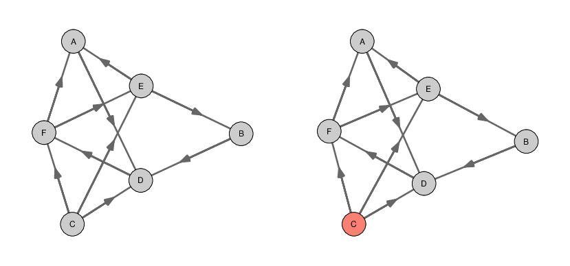

## hanna

R code for the paper - Hermanussen M, Dammhahn M, Scheffler C, Groth D (2023):
_Winner-loser effects improve social network efficiency among competitors with equal resource._

Installation:

```
library(remotes)
remotes::install_github("https://github.com/mittelmark/hanna")
```

Therafter you can check the installation like this:

```
library(hanna)
citation("hanna")
```

Which should display something like this:

```
> citation("hanna")
To cite package 'hanna' in publications use:

  Detlef Groth, University of Potsdam (2023). hanna:
  Winner-looser effects for social network efficiency simulated using
  Monte Carlo simulations. R package version 0.1.

```

## Simulation

If the installation was succesful, you can run a single season giving the
agents as many tokens as there are agents in the game using the default null model like this:

```
 > library(hanna)
 > res=simul$season(LETTERS[1:6])
 > res$token
 ## $token
 ## A B C D E F 
 ## 7 8 4 5 7 5 
 > res$M
 ## $M
 ##    A  B C  D  E F
 ## A  0 -1 1  1  0 0
 ## B  1  0 0  1  0 0
 ## C -1  0 0 -1  0 0
 ## D -1 -1 1  0 -1 1
 ## E  0  0 0  1  0 0
 ## F  0  0 0 -1  0 0
```

The token does represent the overall win and loosing points, so for instance A
has won 2 times and lost 1 time so it has 6+2-1 token remaining, it is 7. In
the null model win/loose changes are independent from the number of tokens. To
use other models consult the help page from ?simul_season. More details are as
well shown in the package vignette which you can read usually by writing
`vignette('simul-tutorial')` in your R console.

If you have such a season with the embedded result matrix you can visualize
this by using the function `simul$graph` and plotting the resulting adjacency
matrix like this:

```
> A = simul$graph(res$M,model='win')
> par(mfrow=c(1,2),mai=rep(0.4,2))  
> hgraph$plot(A)  
> cols=hgraph$colors(A)
> hgraph$plot(A,vertex.color=cols)
```



Agents which are winning all games are shown here in red, agents loosing all
games would be shown in blue. For more examples on how to do simulations using
the other models look at the manual pages and at the package vignettes.
 
## Author and License

Author: Detlef Groth, University of Potsdam, Germany

License: MIT license, see file [LICENSE](LICENSE).

## Bugs and Suggestions

Please use the [Issues](https://github.com/mittelmark/hanna/issues) link on
top of this README on Github.
