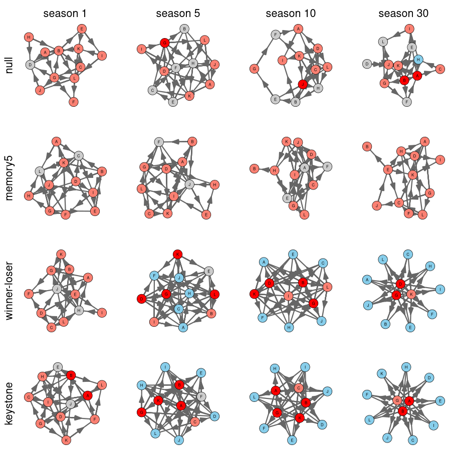
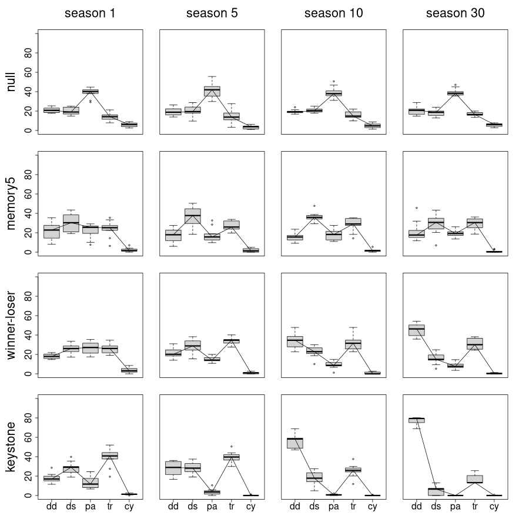

## Introduction

Below you find the code for the figure for the paper of Hermanussen et. al.
2023. Please keep in mind that Monte Carlo simulations will not produce always the same results. So the figures and the table at the end will vary alway a little bit, the general tendency however will be always the same.

The principal approach is to let the agents play against each other, for this
we need pairings of every against every one, like in a tournament. The simul$pairings function does just this, create pairings over several rounds.

Here some season pairings for a small competition of four agens, A, B, C and D:

```{r}
library(hanna)
simul$pairings(LETTERS[1:4])
```

This function is used internally to play these matches for a single round,
season like this:

```{r}
res=simul$season(LETTERS[1:6])
res
```

Let's now convert this to an undirected graph where edges are drawn between
teams which draw against each other:

```{r}
U = simul$graph(res$M,mode='draw')
U
```

Now a directed graph where an edge is drawn from the winning team to the
loosing team in a match, we can say the winner dominates the looser. We can visualize this using our helper module `hgraph`:

```{r fig.width=8,fig.height=4,out.width=1000}
D = simul$graph(res$M,mode='win')
D
par(mfrow=c(1,2),mai=rep(0.2,4))
hgraph$plot(D,vertex.color=hgraph$colors(D))
hgraph$plot(U)
```

## Model comparison

Please note, that due to the given seed the results will vary slightly, but
the general tendency will be the same. The code below will repeat the seasons
again and again taking the token from the last season into the new one, we run
30 iterations, and after season 1, 5, 10 and 30 we draw the resulting graphs:

```{r fig.width=14,fig.height=18,out.width=900,eval=FALSE}
png("networks.png",width=900,height=900)
set.seed(128)
par(mfrow=c(4,4),mai=c(0.0,0.5,0.5,0.0))
colors=c('grey80','#ff9999','#bb5555')
n=12
for (mode in c('null','memory5','gain','keystone')) {
    for (i in 1:30) {
        if (i == 1) {
            if (mode == "keystone") {
                res=simul$season(LETTERS[1:n],model=mode,token=c(24,24,rep(12,n-2)))
            } else if (mode=="memory1") {
               res=simul$season(LETTERS[1:n],model=mode,memory.length=1)
            } else if (mode=="memory5") {
               res=simul$season(LETTERS[1:n],model=mode,memory.length=5)
            } else {
               res=simul$season(LETTERS[1:n],model=mode)
            }
        } else {
            if (mode=="memory1") {
               res=simul$season(LETTERS[1:n],model=mode,memory.length=1,memory=res$memory)
            } else if (mode=="memory5") {
               res=simul$season(LETTERS[1:n],model=mode,memory.length=5,memory=res$memory)
            }  else {
                res=simul$season(LETTERS[1:12],token=res$token,model=mode)
            }
        }  
        D = simul$graph(res$M,mode='win') 
        cols=hgraph$colors(D,col=colors)
        if (i %in% c(1,5,10,30)) {
            hgraph$plot(D,vertex.color=cols,vertex.size=0.8)
            if (i == 1) {
                if (mode == "gain") {
                   mtext("winlose",side=2,cex=1.5,line=0)
                } else {
                    mtext(mode,side=2,cex=1.5,line=0)
                }   
            }
        
            if (mode == "null") {
                mtext(i,side=3,line=0,cex=1.5)
            }
        }
    }   
}
dev.off()
```

<center>

</center>

## Triad counting

What are the triads, so edge releations between tree connected nodes. We
differentiate between:

* double dominant (dd, for example A dominates B and C)
* double subordinate (ds, for example A is dominated by B and C)
* pass-along (pa, like A dominates B and B dominates C)
* transitive (tr, A dominates B and C, and B dominates C
* cycles (cy, here A dominates B, B dominates C, and then C dominates A)

For more details look at the paper. Here the resulting triad counts after
1,5,10 and 30 iterations, each time with 10 repetitions:


```{r fig.width=14,fig.height=14,out.width=800,eval=TRUE}
set.seed(129) 
png("triads.png",width=900,height=900)
par(mfcol=c(4,4),omi=c(0.5,0.7,0.5,0.3),mai=rep(0.2,4))  
for (i in c(1,5,10,30)) {
    res.df=simul$compare(n=10,seasons=i) 
    for (mod in c("null", "memory5","gain","keystone")) {  
       #rest=t(scale(t(res.df[res.df$model==mod,1:5]))) 
       rest=t(apply(res.df[res.df$model==mod,1:5],1,function(x) { (x/sum(x))*100} ))
       #rest=cbind(rest,res.df[,6])
       boxplot(rest,ylim=c(0,100),axes=FALSE) 
       lines(1:5,apply(rest,2,median)) 
       if (i == 1) {
          if (mod == "gain") {
            mtext("winlose",side=2,cex=1.5,line=3)
          } else {
            mtext(mod,side=2,cex=1.5,line=3)
          }
       }
       box()
       if (mod == "null") {
           mtext(i,side=3,cex=1.5,line=3)
       }
       if (i == 1) {
             axis(2,cex.axis=1.5)

       }
       if (mod == "keystone") {
         axis(1,labels=colnames(rest),at=1:5,cex.axis=1.5)
       }
        if (i == 1 & mod == "null") {
            res.all=cbind(res.df,iter=rep(i,nrow(res.df)))
        } else {
            res.all=rbind(res.all,cbind(res.df,iter=rep(i,nrow(res.df))))
        }
    } 
}
dev.off()
```

<center>

</center>

## Measure sd and mean for the average path lengths

We now determine the average path length converting the directed edges into
undirected ones. We as well use a weighted path length where the path length
is smaller for nodes with a high degree. The assumption is that high degree
nodes are more important than low degree nodes and that transport of
information over high degree nodes should be of higher prioriry.

We use here the networks from the previous runs and aggregate the data from
there. The code below is not evaluated every time the vignette is build as the
simulation take a lot of time and so the data are pre computed to avoid delays
in package installation.

```{r eval=TRUE}
agg1=with(res.all,aggregate(pls, by=list(model,iter), mean,na.rm=TRUE))
agg2=with(res.all,aggregate(pls, by=list(model,iter), sd,na.rm=TRUE))
agg3=with(res.all,aggregate(wls, by=list(model,iter), mean,na.rm=TRUE))
agg4=with(res.all,aggregate(wls, by=list(model,iter), sd,na.rm=TRUE))
head(agg1,n=10) 
head(agg2,n=10) 
agg=cbind(agg1,agg2$x,agg3$x,agg4$x)
colnames(agg)=c('model','seasons','mean.apl','sd.apl','mean.wapl','sd.wapl')
head(agg)
write.table(agg,file="../inst/results/results.tab",sep="\t",quote=FALSE)
```

No we display the results, they were cached in previous runs:

```{r eval=TRUE}
if (file.exists(file.path("../inst/results/results.tab"))) {
    agg=read.table("../inst/results/results.tab",header=TRUE,sep="\t")
    library(knitr)
    for (i in 3:6) {
        agg[,i]=round(agg[,i],3)
    }   
    agg=agg[agg$model %in% c("gain","keystone","memory5","null"),]
    knitr::kable(agg)
} else {
    print("results-file does not exists!")
}
```

Gain is here the winner-looser model.


